####androidGraphics（八）——Paint之ColorMatrix

>前言：虽然梦想为了现实暂时会妥协，但终有一天，它将会实现

这篇主要讲解ColorMatrix的相关知识，这里将涉及到矩阵乘法的相关知识。所以这篇是比较有难度的。
 
####一、矩阵概述
#####1、定义
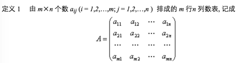
称为m*n矩阵
####2、矩阵乘法
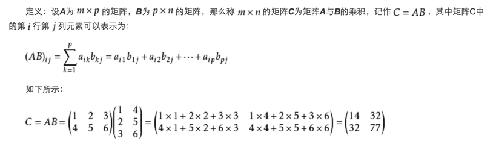
矩阵乘法其实并不难，它的意思就是将第一个矩阵A的第一行，与第二个矩阵B的第一列的数字分别相乘，得到的结果相加，最终的值做为结果矩阵的第(1,1)位置的值（即第一行，第一列）。
同样，A矩阵的第一行与B矩阵的第二列的数字分别相乘然后相加，结果做为结果矩阵第(1，2)位置的值（即第一行第二列）。
再如，A矩阵的第二行与B矩阵的第一列的数字分别相乘，然后相加，结果做为结果矩阵的第（2，1）位置的值（即第二行第一列）
算法其实并不难，这里要说明一个问题：
- A矩阵的列数必须与B矩阵的行数相同，才能相乘！因为我们需要把A中的一行中的各个数字与B矩阵中的一列中的各个数字分别相乘，所以A的列数与B的行数必须相同才行！
- 矩阵A乘以矩阵B和矩阵B乘以矩阵A的结果必然是不一样的。
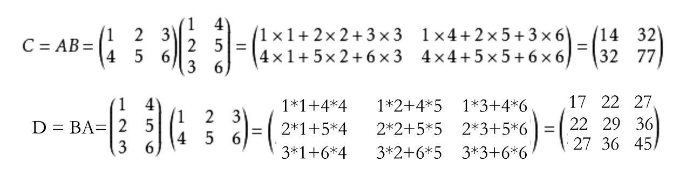
####二、色彩矩阵
对于色彩的存储，Bitmap类使用一个32位的数值来保存。红、绿、蓝及透明度各占8位，每一个色彩分量的取值范围是0-255。透明度为0表示完全透明，为255时，色彩完全可见。
#####1、色彩信息的矩阵表示
**四阶表示**
由于一个色彩信息包含R、G、B、Alpha信息，所以，我们必然要使用一个4阶色彩变换矩阵来修改色彩的每一个分量值：
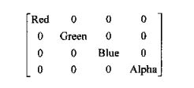
注意：对于色彩变换矩阵，这里的色彩顺序是R、G、B、A而不是A、R、G、B！！！
如果想将色彩（0，255，0，255）更改为半透明时，可以使用下面的的矩阵运算来表示：
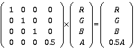
**为什么使用五阶矩阵**
上面使用四阶矩阵完全可以改变图片的RGBA值了，但考虑一种情况，如果我们只想在原有的R色上增加一些分量呢？
这时，我们就得再多加一阶来表示平移变换。所以，一个既包含线性变换，又包含平移变换的组合变换，称为仿射变换。使用四阶的色彩变换矩阵来修改色彩，只能够对色彩的每一个分量值进行乘（除）运算，如果要对这些分量值进行加减法的运算（平移变换），只能通过五阶矩阵来完成。
考虑下面这个变换：
1、红色分量值更改为原来的2倍；
2、绿色分量增加100；
则使用4阶矩阵的乘法无法实现，所以，应该在四阶色彩变换矩阵上增加一个“哑元坐标”，来实现所列的矩阵运算:
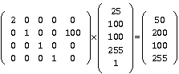
这个矩阵中，分量值用的是100
####三、Android中的色彩矩阵
#####1、概述
在上面的所有讲解之后，大家也应该看出来了，色彩变换矩阵的表示形式，肯定是五阶的那种，所以大家看一下，在默认情况下，色彩变换矩阵的形式：
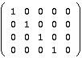
Android中的色彩矩阵是用ColorMatrics类来表示的。使用ColorMatrix的方法如下：
``` java
// 生成色彩矩阵  
ColorMatrix colorMatrix = new ColorMatrix(new float[]{  
        1, 0, 0, 0, 0,  
        0, 1, 0, 0, 0,  
        0, 0, 1, 0, 0,  
        0, 0, 0, 0.5, 0,  
});  
mPaint.setColorFilter(new ColorMatrixColorFilter(colorMatrix));  
```
有关setColorFilter()函数的其它用法，下篇文章我们将会详细讲述，这篇我们只知道怎么设置ColorMatrix对象就可以了。
#####2、示例1（单个颜色的蓝色通道输出）
下面我们举个例子来简单看一下，我们对一个颜色值进行ColorMatrix操作会怎样：
``` java
public class MyView extends View {
    private Paint mPaint = new Paint();
    private Bitmap bitmap;// 位图

    public MyView(Context context, AttributeSet attrs) {
        super(context, attrs);   
    }

    @Override
    protected void onDraw(Canvas canvas) {
        super.onDraw(canvas);
        mPaint.setAntiAlias(true);
        mPaint.setARGB(255,200,100,100);
        // 绘制原始位图
        canvas.drawRect(0,0,500,600,mPaint);

        canvas.translate(550,0);
        // 生成色彩矩阵
        ColorMatrix colorMatrix = new ColorMatrix(new float[]{
                0, 0, 0, 0, 0,
                0, 0, 0, 0, 0,
                0, 0, 1, 0, 0,
                0, 0, 0, 1, 0,
        });
        mPaint.setColorFilter(new ColorMatrixColorFilter(colorMatrix));
        canvas.drawRect(0,0,500,600,mPaint);
    }
}
```
在上面中，我们先将图笔颜色值设为(255,200,100,100)，然后对其进行ColorMatrix颜色值运算，把红色和绿色都去掉，仅显示蓝色值；只显示蓝色值的效果在Photoshop中叫做蓝色通道。效果图如下：
左侧是原图，右侧是该图对应的蓝色通道
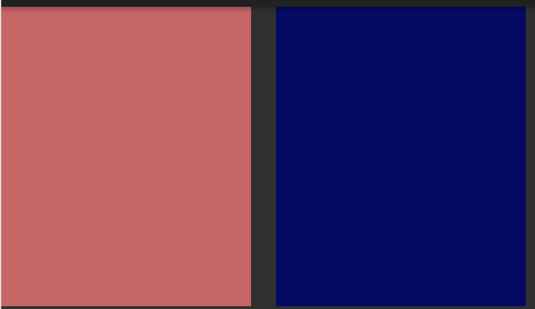
这里只是对一个颜色值，而ColorMatrics的最厉害的地方在于，能够很批量地改变图像中的所有颜色值。下面我们就对图像应用ColorMatrics的例子来看看，如果只显示图像中的蓝色通道会怎样
#####3、示例2（图片多颜色的蓝色通道输出）
下面我们就举个给Bitmap应用ColorMatrix的例子：
``` java
public class MyView extends View {
    private Paint mPaint = new Paint();
    private Bitmap bitmap;// 位图

    public MyView(Context context, AttributeSet attrs) {
        super(context, attrs);

        mPaint.setAntiAlias(true);
        // 获取位图
        bitmap = BitmapFactory.decodeResource(context.getResources(), R.drawable.dog);
    }

    @Override
    protected void onDraw(Canvas canvas) {
        super.onDraw(canvas);

        // 绘制原始位图
        canvas.drawBitmap(bitmap, null, new Rect(0, 0, 500, 500 * bitmap.getHeight() / bitmap.getWidth()), mPaint);

        canvas.translate(510, 0);
        // 生成色彩矩阵
        ColorMatrix colorMatrix = new ColorMatrix(new float[]{
                0, 0, 0, 0, 0,
                0, 0, 0, 0, 0,
                0, 0, 1, 0, 0,
                0, 0, 0, 1, 0,
        });
        mPaint.setColorFilter(new ColorMatrixColorFilter(colorMatrix));
        canvas.drawBitmap(bitmap, null, new Rect(0, 0, 500, 500 * bitmap.getHeight() / bitmap.getWidth()), mPaint);
    }
}
```
这里分两次绘制了一个bitmap，第一次绘制了一个原始图像，然后利用ColorMatrix生成了一个仅包含蓝色的图像，用过PhotoShop的同学应该很清楚这个跟Photoshop中的蓝色通道的效果是一致的。效果图如下：

>大家注意哦，不要在onDraw里new Paint对象，上节中我为了省事就直接在onDraw（）函数中直接new 了Paint对象，由于onDraw函数在刷新时会连续调用多次，所以如果在其中不断的new对象，会造成程序不断的GC(内存回收)，是会严重影响性能的！在程序中，我有时会了为了方便理解，就直接在onDraw（）中创建对象了，大家在实际应用中一定要杜绝这种应用哦。
####四、色彩的几种运算方式
在简单理解了ColorMatrics的使用方式后，我们来详细来看看色彩的几种运算方式；
#####1、色彩的平移运算
色彩的平移运算，实际上就是色彩的加法运算。其实就是在色彩变换矩阵的最后一行加上某个值；这样可以增加特定色彩的饱和度
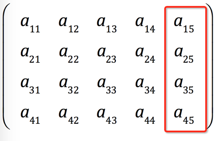
比如，同样是上面的图片，我们给它应用下面的色彩值：
``` java
ColorMatrix colorMatrix = new ColorMatrix(new float[]{
        1, 0, 0, 0, 0,
        0, 1, 0, 0, 50,
        0, 0, 1, 0, 0,
        0, 0, 0, 1, 0,
});
```
在绿色值上添加增量50，即增大绿色的饱和度。效果图如下：

同样，左侧是原图，右侧是增大绿色饱和度后的效果；大家要特别注意的是，由于图片是由一个个像素组成的，所以用每个像素的饱和度组成数组，来乘转换矩阵，结果就是转换后的当前点的颜色值；所以，在应用ColorMatrics后，图片中每个像素的绿色值都增加了50，从小狗脸上也可以看出来，狗脸也变绿了（它可能看到他女朋友跟人家跑了，哈哈）！
色彩平移除了增加指定颜色饱和度以外，另一个应用就是色彩反转(PhotoShop中的反相功能)
色彩反转就是求出每个色彩的补值来做为目标图像的对应颜色值：
``` java
ColorMatrix colorMatrix = new ColorMatrix(new float[]{
        -1,0,0,0,255,
        0,-1,0,0,255,
        0,0,-1,0,255,
        0,0,0,1,0
});
```
效果图如下：


#####2、色彩的缩放运算
色彩的缩放运算其实就是色彩的乘法运算。在色彩矩阵对角线上的分别代表R、G、B、A的几个值，将其分别乘以指定的值。这就是所谓的缩放变换。
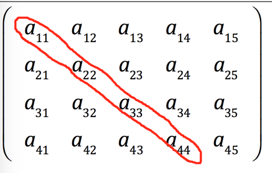
我们可以针对某一个颜色值进行放大缩小运算，但当对R、G、B、A同时进行放大缩小时，就是对亮度进行调节！
看下面的将亮度增大1.2倍的代码：
``` java
ColorMatrix colorMatrix = new ColorMatrix(new float[]{
        1.2f, 0, 0, 0, 0,
        0, 1.2f, 0, 0, 50,
        0, 0, 1.2f, 0, 0,
        0, 0, 0, 1.2f, 0,
});
```
效果图如下：

#####3、缩放变换的特殊应用（通道输出）
由于在色彩变换矩阵中，对角线上的数的取值范围是从0-1的，所以当取0时，这个色彩就完全不显示，所以当我们R、G都取0，而独有B取1时，就只显示了蓝色，所形成的图像也就是我们通常说的蓝色通道；看下几个通道输出的效果图：
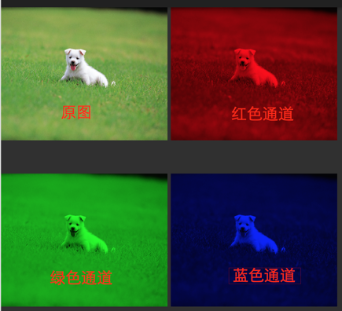
红色通道矩阵：
``` java
ColorMatrix colorMatrix = new ColorMatrix(new float[]{
       1, 0, 0, 0, 0,
       0, 0, 0, 0, 0,
       0, 0, 0, 0, 0,
       0, 0, 0, 1, 0,
});
```
绿	色通道矩阵：
``` java
ColorMatrix colorMatrix2 = new ColorMatrix(new float[]{
        0, 0, 0, 0, 0,
        0, 1, 0, 0, 0,
        0, 0, 0, 0, 0,
        0, 0, 0, 1, 0,
});
```
蓝色通道矩阵：
``` java
ColorMatrix colorMatrix3 = new ColorMatrix(new float[]{
        0, 0, 0, 0, 0,
        0, 0, 0, 0, 0,
        0, 0, 1, 0, 0,
        0, 0, 0, 1, 0,
});
```
#####4、色彩的旋转运算
RGB色是如何旋转的呢，首先用R、G、B三色建立立体坐标系：
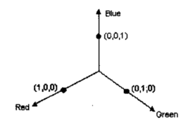
所以，我们可以把一个色彩值看成三维空间里的一个点，色彩值的三个分量可以看成该点的坐标（三维坐标）。我们先不考虑，在三个维度综合情况下是怎么旋转的，我们先看看，在某个轴做为Z轴，在另两个轴形成的平面上旋转的情况，下图分析了，在将蓝色轴做为Z轴，仅在红—绿平面上旋转a度的情况：
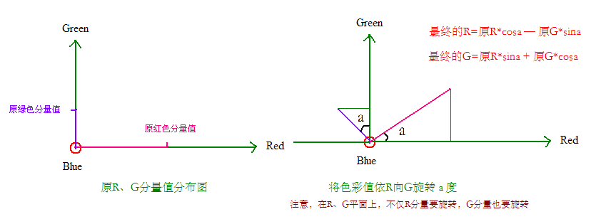
在图中，我们可以看到，在旋转后，原R在R轴的分量变为:原R*cosa，但原G分量在旋转后，在R轴上也有了分量，但分量落在了负轴上，所以我们要减去这部分分量，所以最终的结果是最终的R=原R*cosa-原G*sina;
下面就看下关于几种旋转计算及结果矩阵，（注意：这几个图只标记了原X轴色彩分量的旋转，没有把Y轴色彩分量的旋转标记出来）
**绕蓝色轴旋转a度**
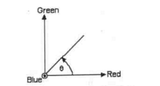
对应的色彩变换矩阵是
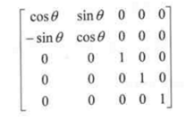
**绕红色轴旋转a度**
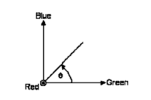
对应的色彩变换矩阵是
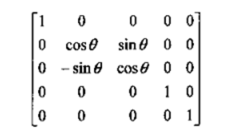
**绕绿色轴旋转a度**
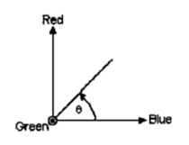
对应的色彩变换矩阵是
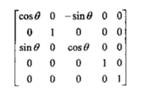
>当围绕红色轴进行色彩旋转时，由于当前红色轴的色彩是不变的，而仅利用三角函数来动态的变更绿色和蓝色的颜色值。这种改变就叫做色相调节！当围绕红色轴旋转时，是对图片就行红色色相的调节；同理，当围绕蓝色颜色轴旋转时，就是对图片就行蓝色色相调节；当然，当围绕绿色轴旋转时，就是对图片进行绿色色相的调节.

下面我们做一个动态的调节，针对红	色色相。
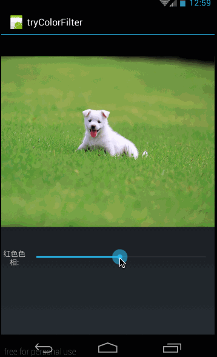
这个效果图表示的是，在滚轮正中间位置时表示旋转角度为0度，最右侧位置表示向正方向旋转180，左侧到底表示负方向旋转180.
同理可以得到围绕绿色轴旋转的效果图：

最后是，围绕蓝色轴旋转的效果图：

下面我们会再次讲到ColorMatrics的色彩旋转函数，这里先理解原理和效果，代码后面会给出。
#####5、色彩的投射运算
我们再回过头来看看色彩矩阵运算的公式：
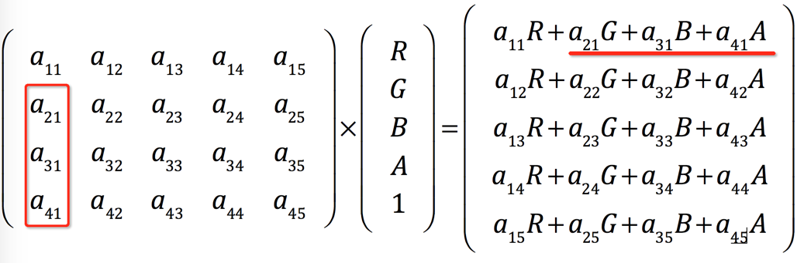
其中我把红色运算给单独拉了出来，红色标记的那几个元素a21,a31,a41,在运算中，是利用R、B、A的颜色值的分量来增加红色值的。
来看具体的运算：
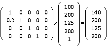
注意：最终结果的140=1*100+0.2*200,可见红色分量在原有红色分量的基础上，增加了绿色分量值的0.2倍；利用其它色彩分量的倍数来更改自己色彩分量的值，这种运算就叫投射运算。
下图阴影部分；对这些值进行修改时，修改所使用的增加值来自于其它色彩分量的信息。
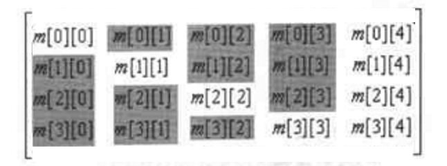
色彩投射的一个最简单应用就是变为黑白图片：
``` java
ColorMatrix colorMatrix = new ColorMatrix(new float[]{
        0.213f, 0.715f, 0.072f, 0, 0,
        0.213f, 0.715f, 0.072f, 0, 0,
        0.213f, 0.715f, 0.072f, 0, 0,
        0,       0,    0, 1, 0,
});
```
效果图：
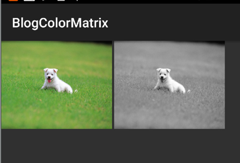
首先了解一下去色原理：只要把RGB三通道的色彩信息设置成一样；即：R＝G＝B，那么图像就变成了灰色，并且，为了保证图像亮度不变，同一个通道中的R+G+B=1:如：0.213+0.715+0.072＝1；
三个数字的由来：0.213, 0.715, 0.072；
按理说应该把RGB平分，都是0.3333333。三个数字应该是根据色彩光波频率及色彩心理学计算出来的（本人是这么认为，当然也查询了一些资料，目前尚未找到准确答案）。
在作用于人眼的光线中，彩色光要明显强于无色光。对一个图像按RGB平分理论给图像去色的话，人眼就会明显感觉到图像变暗了（当然可能有心理上的原因，也有光波的科学依据）另外，在彩色图像中能识别的一下细节也可能会丢失。
所以google最终给我们的颜色值就是上面的比例：0.213, 0.715, 0.072；
所以，在给图像去色时我们保留了大量的G通道信息，使得图像不至于变暗或者绿色信息不至于丢失（我猜想）。
投射运算的另一个应用是：色彩反色
当我们利用色彩矩阵将两个颜色反转，这种操作就叫做色彩反色
比如，下面的的将红色和绿色反色（红绿反色）
``` java
ColorMatrix colorMatrix = new ColorMatrix(new float[]{
        0,1,0,0,0,
        1,0,0,0,0,
        0,0,1,0,0,
        0,0,0,1,0
});
```
效果图如下：
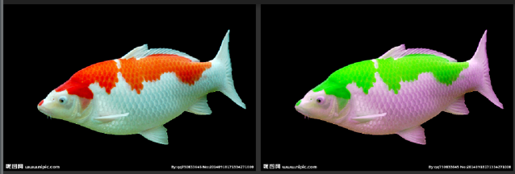
左侧的图为原图，右边为红绿反色以后的效果图;
从矩阵中可以看出红绿反色的关键在于，第一行用绿色来代替了红色，第二行用红色代替了绿色。
类似可以有红蓝反色，绿蓝反色等，对应矩阵难度不大，就不再细讲了。
**变旧照片**
投射运算的另一个应用是照片变旧，对应矩阵如下：
``` java
ColorMatrix colorMatrix = new ColorMatrix(new float[]{
        1/2f,1/2f,1/2f,0,0,
        1/3f,1/3f,1/3f,0,0,
        1/4f,1/4f,1/4f,0,0,
        0,0,0,1,0
});
```

####五、ColorMatrix函数
上面讲了利用色彩矩阵的来做一些运算，但这些都是需要特定的色彩设计基础的，Android中ColorMatrix自带了一些函数来帮我们完成一些调整饱和度、色彩旋转等操作的函数，我们就一一来看看
#####1、构造函数
ColorMatrix共有三个构造函数：
``` java
ColorMatrix()
ColorMatrix(float[] src)
ColorMatrix(ColorMatrix src)
```
这三个构造函数中，上面我们已经使用过第二个构造函数了，第三个构造函数，就是利用另一个ColorMatrix实例来复制一个一样的ColorMatrix对象。
#####2、设置、重置函数
第一个构造函数```ColorMatrix()```，需要与其它函数共用能行：
``` java
public void set(ColorMatrix src)
public void set(float[] src)
public void reset()
```
这里是设置和重置函数，重置后，对应的数组为：
``` java
/**
* Set this colormatrix to identity:
* [ 1 0 0 0 0   - red vector
*   0 1 0 0 0   - green vector
*   0 0 1 0 0   - blue vector
*   0 0 0 1 0 ] - alpha vector
*/
```
这些函数难度都不大，就不再讲了
#####3、setSaturation——设置饱和度
上面我们讲过，我们可以通过色彩的平移运算单独增强R,G,B其中一个的饱和度，但当我们需要整体增强图像的饱和度时需要如何来做呢？ColorMatrics给我们提供了一个方法来整体增强图像的饱和度，函数如下：
``` java
//整体增强颜色饱和度，即同时增强R,G,B的色彩饱和度
public void setSaturation(float sat)
```
其中：
参数float sat：表示把当前色彩饱和度放大的倍数。取值为0表示完全无色彩，即灰度图像（黑白图像）；取值为1时，表示色彩不变动；当取值大于1时，显示色彩过度饱和
我们来看个例子：

滑块默认在一倍的位置，向左到底是0，向右到底是20（即饱和度放大20倍）
下面来看看代码：
**先来看看布局代码：(main.xml)**
``` java
<?xml version="1.0" encoding="utf-8"?>
<LinearLayout xmlns:android="http://schemas.android.com/apk/res/android"
              android:orientation="vertical"
              android:layout_width="fill_parent"
              android:layout_height="fill_parent"
        >

    <ImageView
            android:id="@+id/img"
            android:layout_width="fill_parent"
            android:layout_height="wrap_content"
            android:scaleType="centerCrop"
            android:src="@drawable/dog"
            />

    <LinearLayout
            android:layout_marginTop="10dp"
            android:layout_width="match_parent"
            android:layout_height="match_parent"
            android:orientation="horizontal">

        <TextView
                android:layout_width="wrap_content"
                android:layout_height="wrap_content"
                android:text="饱和度(0-20):"/>

        <SeekBar
                android:id="@+id/seekbar"
                android:layout_width="match_parent"
                android:layout_height="wrap_content"/>

    </LinearLayout>

</LinearLayout>
```
布局很简单，根据效果图不难理解出来；
**然后来看看效果处理代码(MyActivity.java)**
``` java
public class MyActivity extends Activity {
    private SeekBar mSeekBar;
    private ImageView mImageView;
    private Bitmap mOriginBmp,mTempBmp;
    @Override
    public void onCreate(Bundle savedInstanceState) {
        super.onCreate(savedInstanceState);
        setContentView(R.layout.main);

        mImageView = (ImageView) findViewById(R.id.img);
        mSeekBar = (SeekBar)findViewById(R.id.seekbar);
        mOriginBmp = BitmapFactory.decodeResource(getResources(), R.drawable.dog);
        mTempBmp = Bitmap.createBitmap(mOriginBmp.getWidth(), mOriginBmp.getHeight(),
                Bitmap.Config.ARGB_8888);


        mSeekBar.setMax(20);
        mSeekBar.setProgress(1);

        mSeekBar.setOnSeekBarChangeListener(new SeekBar.OnSeekBarChangeListener() {
            @Override
            public void onProgressChanged(SeekBar seekBar, int progress, boolean fromUser) {

                Bitmap bitmap = handleColorMatrixBmp(progress);
                mImageView.setImageBitmap(bitmap);
            }

            @Override
            public void onStartTrackingTouch(SeekBar seekBar) {

            }

            @Override
            public void onStopTrackingTouch(SeekBar seekBar) {

            }
        });

    }

    private Bitmap  handleColorMatrixBmp(int progress){
        // 创建一个相同尺寸的可变的位图区,用于绘制调色后的图片
        Canvas canvas = new Canvas(mTempBmp); // 得到画笔对象
        Paint paint = new Paint(); // 新建paint
        paint.setAntiAlias(true); // 设置抗锯齿,也即是边缘做平滑处理
        ColorMatrix mSaturationMatrix = new ColorMatrix();
        mSaturationMatrix.setSaturation(progress);

        paint.setColorFilter(new ColorMatrixColorFilter(mSaturationMatrix));// 设置颜色变换效果
        canvas.drawBitmap(mOriginBmp, 0, 0, paint); // 将颜色变化后的图片输出到新创建的位图区
        // 返回新的位图，也即调色处理后的图片
        return mTempBmp;
    }
}
```
最关键的位置在于，在调整progress时，生成对应图像的过程：
``` java
private Bitmap  handleColorMatrixBmp(int progress){
    // 创建一个相同尺寸的可变的位图区,用于绘制调色后的图片
    Canvas canvas = new Canvas(mTempBmp); // 得到画笔对象
    Paint paint = new Paint(); // 新建paint
    paint.setAntiAlias(true); // 设置抗锯齿,也即是边缘做平滑处理
    ColorMatrix mSaturationMatrix = new ColorMatrix();
    mSaturationMatrix.setSaturation(progress);

    paint.setColorFilter(new ColorMatrixColorFilter(mSaturationMatrix));// 设置颜色变换效果
    canvas.drawBitmap(mOriginBmp, 0, 0, paint); // 将颜色变化后的图片输出到新创建的位图区
    // 返回新的位图，也即调色处理后的图片
    return mTempBmp;
}
```
mTempBmp是生成的一个跟原始的bitmap同样大小的空白图片，然后在设置的Paint的ColorMatrics之后，利用canvas.drawBitmap(mOriginBmp, 0, 0, paint);在原始图片的基础上应用Paint把生成的图像画在canvas上。drawBitmap()的第一个参数表示的是源图像；
**源码在文章底部给出**
#####4、setScale——色彩缩放
同样，对于色彩的缩放运算ColorMatrics也已经为我们封装了一个函数：
``` java
public void setScale(float rScale, float gScale, float bScale,float aScale)
```
总共有四个参数，分别对应R,G,B,A颜色值的缩放倍数。
比如，在小狗图片中，绿色占大部分，所以我们仅将绿色放大1.3倍：
``` java
canvas.drawBitmap(bitmap, null, new Rect(0, 0, 500, 500 * bitmap.getHeight() / bitmap.getWidth()), mPaint);

canvas.save();
canvas.translate(510, 0);
// 生成色彩矩阵
ColorMatrix colorMatrix = new ColorMatrix();
colorMatrix.setScale(1,1.3f,1,1);
mPaint.setColorFilter(new ColorMatrixColorFilter(colorMatrix));

canvas.drawBitmap(bitmap, null, new Rect(0, 0, 500, 500 * bitmap.getHeight() / bitmap.getWidth()), mPaint);
```
效果图如下：
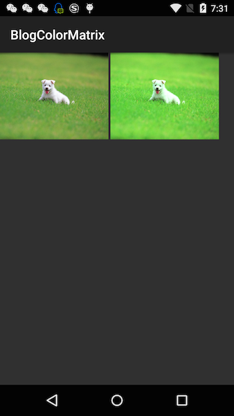
在仅将绿色放大1.3倍后，整个图片看起来更鲜艳了有没有。
#####5、setRotate——色彩旋转
上面在讲解色彩旋转运算时，给大家列出了在色彩旋转时的效果和原理，由于涉及到正余弦函数的计算，而且这些公式推导起来相当具有难度，所以Android的大大们，已经给我们封装好了色彩旋转的函数：
``` java
/**
 * 将旋转围绕某一个颜色轴旋转
 * axis=0 围绕红色轴旋转
 * axis=1 围绕绿色轴旋转
 * axis=2 围绕蓝色轴旋转
 */
public void setRotate(int axis, float degrees)；
```
这里有两个参数：
- int axis：表示围绕哪个轴旋转，取值为0，1，2；取0时表示围绕红色轴旋转；取值1时，表示围绕绿色轴旋转；取值2时，表示围绕蓝色轴旋转；
- float degrees：表示旋转的度数

在上面在介绍色彩旋转的算法时，已经给大家看了当围绕某一个轴旋转时色相变化的效果图，同样是利用上面的图像和滑动条的框架，只是在处理时有些不同：

 处理代码如下：
``` java
public class SecondActivity extends Activity {
    private SeekBar mSeekBar;
    private ImageView mImageView;
    private Bitmap mOriginBmp,mTempBmp;
    @Override
    public void onCreate(Bundle savedInstanceState) {
        super.onCreate(savedInstanceState);
        setContentView(R.layout.main);

        mImageView = (ImageView) findViewById(R.id.img);
        mSeekBar = (SeekBar)findViewById(R.id.seekbar);
        mOriginBmp = BitmapFactory.decodeResource(getResources(), R.drawable.dog);
        mTempBmp = Bitmap.createBitmap(mOriginBmp.getWidth(), mOriginBmp.getHeight(),
                Bitmap.Config.ARGB_8888);


        mSeekBar.setMax(360);
        mSeekBar.setProgress(180);

        mSeekBar.setOnSeekBarChangeListener(new SeekBar.OnSeekBarChangeListener() {
            @Override
            public void onProgressChanged(SeekBar seekBar, int progress, boolean fromUser) {

                Bitmap bitmap = handleColorRotateBmp(progress);
                mImageView.setImageBitmap(bitmap);
            }

            @Override
            public void onStartTrackingTouch(SeekBar seekBar) {

            }

            @Override
            public void onStopTrackingTouch(SeekBar seekBar) {

            }
        });

    }

    private Bitmap handleColorRotateBmp(int progress){

        // 创建一个相同尺寸的可变的位图区,用于绘制调色后的图片
        Canvas canvas = new Canvas(mTempBmp); // 得到画笔对象
        Paint paint = new Paint(); // 新建paint
        paint.setAntiAlias(true); // 设置抗锯齿,也即是边缘做平滑处理
        ColorMatrix colorMatrix = new ColorMatrix();

        colorMatrix.setRotate(0,progress-180);
        paint.setColorFilter(new ColorMatrixColorFilter(colorMatrix));// 设置颜色变换效果
        canvas.drawBitmap(mOriginBmp, 0, 0, paint); // 将颜色变化后的图片输出到新创建的位图区
        // 返回新的位图，也即调色处理后的图片
        return mTempBmp;
    }
}
```
这里的代码与调节饱和度的代码都是一样的，只是有两点不同：
第一：设置SeekBar范围：
``` java
mSeekBar.setMax(360);
mSeekBar.setProgress(180);
```
设置的值是0到360，当前位置在180的位置；
第二：处理当前progress
在handleColorRotateBmp函数中：
``` java
ColorMatrix colorMatrix = new ColorMatrix();
colorMatrix.setRotate(0,progress-180);
paint.setColorFilter(new ColorMatrixColorFilter(colorMatrix));/
```
将当前progress位置减去180，即中间位置的数字。所以在中间位置的色彩旋转度数为0，整个旋转度数的范围是-180到180；360度正好是正余弦函数的一个最小正周期
代码难度不大，就不再细讲了。
#####6、ColorMatrics相乘
这部分是ColorMatrics里最难的部分了……因为涉及到两个矩阵相乘……不过这段基本用不到，理解不了的同学也无所谓……
矩阵相乘涉及到三个函数：
``` java
public void setConcat(ColorMatrix matA, ColorMatrix matB)
```
这个函数接收两个ColorMatrix矩阵matA和matB，乘法规则为matA*matB，然后将结果做为当前ColorMatrix的值。（为什么要强调乘法规则为matA*matB？我们前面讲过矩阵A*矩阵B和矩阵B*矩阵A的结果是不一样的！）
``` java
public void preConcat(ColorMatrix prematrix)
```
假如当前矩阵的A，而preConcat的意思就是将当前的矩阵A乘以prematrix
``` java
public void postConcat(ColorMatrix postmatrix)
```
上面prematrix是当前矩阵A*prematrix；而postConcat函数的意义就是postmatrix*当前矩阵A;这就是一个前乘，一个是后乘的区别！我们上面已经很清楚的讲了，前乘和后乘结果是不一样的！
**setConcat(ColorMatrix matA, ColorMatrix matB)**
下面我们先来看看setConcat
``` java
public void setConcat(ColorMatrix matA, ColorMatrix matB)
```
我们提了setConcat会将matA乘以matB，将结果做为当前ColorMatrics实例的颜色矩阵。所以会把当前ColorMatrics实例以前的颜色矩阵给覆盖掉！这是我们首先需要提示的。
然后来看看怎么乘吧,比如有下面两个颜色矩阵：
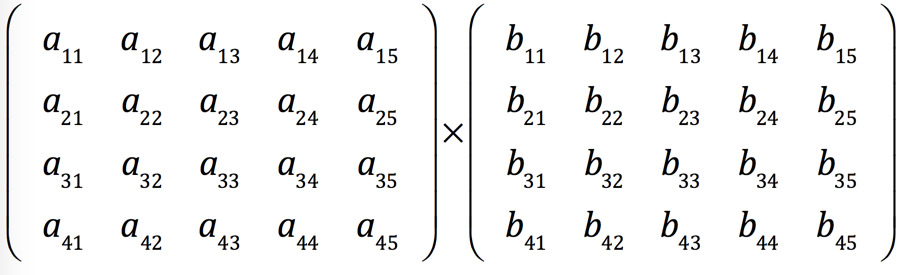
估计有些同学看到这些数字的时候，心头会有一万头草泥马奔过……数学算起来确实是有些难度……慢慢看吧……
我们前面讲过，只有当第一个矩阵的列数等于第二个矩阵的行数的时候，才能相乘！这泥妈不对啊……明明第一个矩阵有五列，而第二个矩阵只有四行……第一个矩阵的最后一列这泥马要打光棍的节奏啊……
这不光是光棍的问题，这两个矩阵是根本没办法相乘的，因为第一个矩阵的列数和第二个矩阵的行数不相等！
那为了解决这个问题，Android提供了一个方案，让这两个矩阵相乘，就是把第一个矩阵的最后一列单独拿出来，另外加到结果上，即：
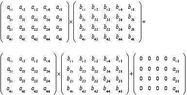
为了验证上面的运算法则，我们使用setConcat函数来做一下实验：
``` java
public class MyActivity extends Activity {
    @Override
    public void onCreate(Bundle savedInstanceState) {
        super.onCreate(savedInstanceState);
        setContentView(R.layout.main);

        ColorMatrix colorMatrix1 = new ColorMatrix(new float[]{
                0.1f, 0.2f, 0.3f, 0.4f, 0.5f,
                0, 1, 0, 0, 0,
                0, 0, 1, 0, 0,
                0, 0, 0, 1, 0,
        });


        ColorMatrix colorMatrix2 = new ColorMatrix(new float[]{
                0.11f, 0, 0, 0, 0,
                0, 0.22f, 0, 0, 0,
                0, 0, 0.33f, 0, 0,
                0, 0, 0, 0.44f, 0,
        });


        ColorMatrix resultMatrix = new ColorMatrix(new float[]{
                0, 0, 0, 0, 0,
                0, 0, 0, 0, 0,
                0, 0, 0, 0, 0,
                0, 0, 0, 0, 0,
        });
        resultMatrix.setConcat(colorMatrix1,colorMatrix2);

        Log.d("qijian",printArray(colorMatrix1.getArray()));
        Log.d("qijian",printArray(colorMatrix2.getArray()));
        Log.d("qijian",printArray(resultMatrix.getArray()));
    }


    private String printArray(float[] array){
        StringBuilder builder = new StringBuilder("array dump:\n");
        for (int i=0;i<array.length;i++){
            if (i%5==0){
                builder.append("\n");
            }
            builder.append(array[i]+" ");
        }
        return builder.toString();
    }

}
```
这段代码很好理解，生成三个ColorMatrics对象colorMatrix1、colorMatrix2和resultMatrix，然后利用resultMatrix.setConcat函数将colorMatrix1与colorMatrix2相乘，结果会覆盖resultMatrix的原有矩阵，最后利用日志把colorMatrix1、colorMatrix2和resultMatrix的最终值打印出来：
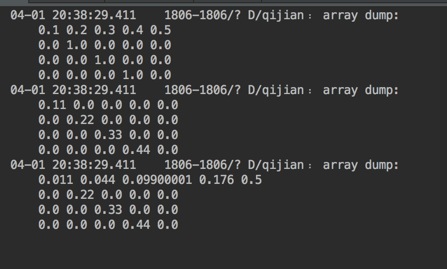
大家可以拿笔来算算，结果是与上面的算法一致的。
**preConcat(ColorMatrix prematrix)**
然后我们来看看postConcat的运算原理：
``` java
``` java
public void preConcat(ColorMatrix prematrix)
```
假如当前ColorMatrix中所对应的矩阵是A，而preConcat的意思就是将当前的矩阵A乘以prematrix
示例代码如下：
``` java
public void onCreate(Bundle savedInstanceState) {
    super.onCreate(savedInstanceState);
    setContentView(R.layout.main);

    ColorMatrix colorMatrix1 = new ColorMatrix(new float[]{
            0.1f, 0.2f, 0.3f, 0.4f, 0.5f,
            0, 1, 0, 0, 0,
            0, 0, 1, 0, 0,
            0, 0, 0, 1, 0,
    });

    ColorMatrix colorMatrix2 = new ColorMatrix(new float[]{
            0.11f, 0, 0, 0, 0,
            0, 0.22f, 0, 0, 0,
            0, 0, 0.33f, 0, 0,
            0, 0, 0, 0.44f, 0,
    });

	//打印出原始的colorMatrix1的矩阵
    Log.d("qijian",printArray(colorMatrix1.getArray()));
    
    colorMatrix1.preConcat(colorMatrix2);
    Log.d("qijian",printArray(colorMatrix2.getArray()));
    //打印出乘后的colorMatrix1的矩阵
    Log.d("qijian",printArray(colorMatrix1.getArray()));
}
```
结果如下：
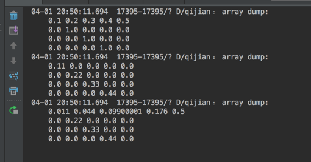
从结果也可以看出，preConcat的意义就是将当前矩阵乘以prematrix矩阵
 **postConcat(ColorMatrix postmatrix)**
 下面我们再看看 postConcat(ColorMatrix postmatrix)
``` java
public void postConcat(ColorMatrix postmatrix)
```
我们上面讲了，上面prematrix是当前矩阵A*prematrix；而postConcat函数的意义就是postConcat*当前矩阵A;刚好与preConcat反过来。所以如果我们在实例中，利用colorMatrix2.postConcat(colorMatrix1);它得到结果应该是与colorMatrix1.preConcat(colorMatrix2);得到结果是一样的,我们来实验一下：
``` java
public void onCreate(Bundle savedInstanceState) {
    super.onCreate(savedInstanceState);
    setContentView(R.layout.main);

    ColorMatrix colorMatrix1 = new ColorMatrix(new float[]{
            0.1f, 0.2f, 0.3f, 0.4f, 0.5f,
            0, 1, 0, 0, 0,
            0, 0, 1, 0, 0,
            0, 0, 0, 1, 0,
    });


    ColorMatrix colorMatrix2 = new ColorMatrix(new float[]{
            0.11f, 0, 0, 0, 0,
            0, 0.22f, 0, 0, 0,
            0, 0, 0.33f, 0, 0,
            0, 0, 0, 0.44f, 0,
    });

    Log.d("qijian",printArray(colorMatrix1.getArray()));
    Log.d("qijian",printArray(colorMatrix2.getArray()));
    colorMatrix2.postConcat(colorMatrix1);
    Log.d("qijian",printArray(colorMatrix2.getArray()));
}
```
结果如下:
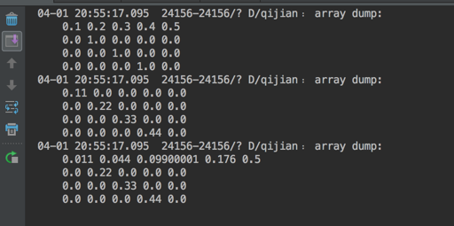
可以看到结果与上面的一模一样哦。这同时也验证了postConcat函数与preConcat函数正好反过来，一个前乘一个后乘
#####7、getArray()获取当前矩阵数组
前面我们已经用到过getArray函数了，getArray函数的意义就是返回当前ColorMatrics对象中的所保存的矩阵
``` java
public float[] getArray()
```
返回值是float[]数组，它的索引顺序为：
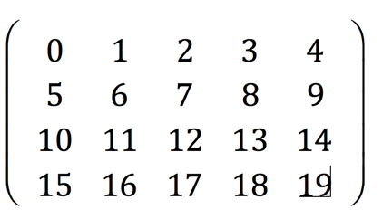

好啦，本篇到这里就结束了，有关矩阵的知识是比较有难度的，但是这篇对于图像处理是至关重要的，因为在有些相机软件中会有各种滤镜效果，这些滤镜效果大部分就是通过更改ColorMatrics矩阵来完成的！当然要完全会构造ColorMatrics矩阵是需要色彩设计相关的知识的；相信通过本篇知识，你也能写出些滤镜效果了，做出来一个简单的图片处理APP也不是问题了哦。下篇将继续给大家说图像处理
**源码在文章底部给出**

源码内容：
1、BlogColorMatrix：图片处理及最后的SetConcat、PreConcat和PostConcat计算都在这里
2、BlogProgressMetrics：通过滚动轴动态改变图像的饱和度和色相的源码在这里哦
